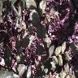
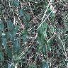
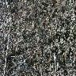
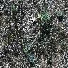

# Plant Classification and Time Series Classification

This repository contains two projects related to Artificial Neural Networks and Deep Learning 2022/2023 course held at Politecnico di Milano

## Group members:
- ###  [Gabriele Ginestroni](https://github.com/gabrieleginestroni)
- ###  [Tommaso Capacci](https://github.com/TommasoCapacci)
- ###  [Simone Giampà](https://github.com/SimonGiampy)

  
Professor: Matteo Matteucci 

### Prerequisites

The following libraries and packages are required to run the code in this project:

- NumPy
- Pandas
- Matplotlib
- Scikit-learn
- TensorFlow
- Keras

## Project 1: Plant Classification
First project consists in solving a classification problem over a set of images taken under different conditions like the following ones:

## Project 2: Time Series Analysis
Second project consists in solving a classification task on time series data. Note that training set has been provided without any additional information about the nature of the process generating the data.
